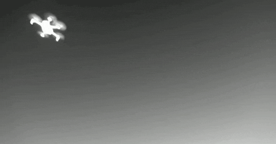

  
 Technical Highlights

- Developed a real-time aerial tracking method for UAVs, drones, and aircraft using the deep learning–based CNN model **YOLOv8 (Ultralytics)**.
- Exported the trained model to **ONNX** for inference
- Applied machine learning and data science techniques including:
  - Dataset preprocessing  
  - Confidence-score filtering  
  - Non-Maximum Suppression (NMS)  
  - Performance evaluation (precision, latency analysis)  
- Optimized the multi-object tracking pipeline to reduce inference latency to **< 30 ms per frame**, enabling reliable tracking of high-speed aerial targets.

 Single Object Tracking Using YOLOv8n

- Developed a real-time single-object tracking system using **YOLOv8n**, a lightweight CNN-based detection model.
- Ensured accurate detection and continuous object tracking across video frames.
- Implemented temporal consistency logic to maintain stable tracking under dynamic conditions.
  
 Angular Estimation Module

- Designed a mathematical feature-extraction and estimation module for **azimuth and elevation prediction**.
- Computed angular offsets from bounding-box center pixels using intrinsic camera **Field-of-View (FOV)** parameters.
- Integrated ML detection outputs with real-time geometry-based calculations for precise angular tracking.

